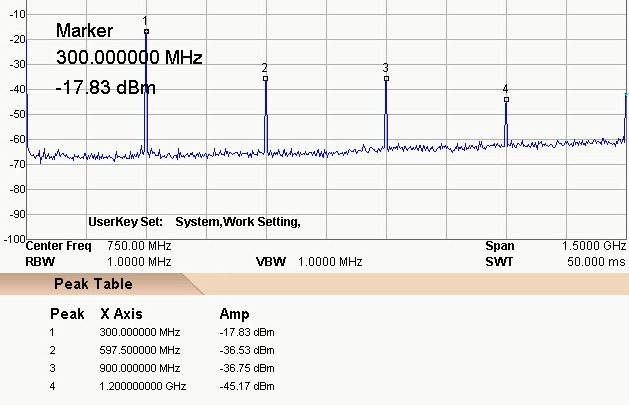

<h2 id="U0">VNA (Vector Network Analyzer)</h2>

 * distinguished from antenna analyzer by having two ports instead of one  
 * distinguished from scaler analyzer e.g. SWR (Standing Wave Ratio) bridge
   by sorting resistance vs reactance instead of lumped *magnitude*.  


VNA Basics
----------
<h3><a href="https://github.com/cho45/NanoVNA-manual/blob/master/index.md">unofficial user guide</a></h3>
<em>thanks to cho45</em> 

<h4><a href="http://www.rvhfg.org/pdf/articles/55.pdf">Keysight</a></h4>
<h4><a href="http://hpmemoryproject.org/an/pdf/an_150-15.pdf">Agilent</a></h4>
<br>

<h4><a href="https://www.youtube.com/watch?v=mKi6s3WvBAM">beginners guide video</a></h4>
<em>thanks to Joe Smith</em>  

<h4><a href="https://www.youtube.com/watch?v=zw7Dp1nwvD8">nanoVNAsharp Windows software video</a></h4>
<em>thanks to IMSAI Guy</em>  

<h4><a href="https://www.youtube.com/watch?v=29yTVG8lg7s">2-port measurements video</a></h4>
<em>thanks to Volker Block</em>  

<h4><a href="https://drive.google.com/file/d/1usvmcn4cR8Ltrb6fT05jA6g7O0uhJozL/view">"official" manual</a></h4>
<br>

Physical attributes
-------------------
**Measurement range**:  
 `70dB (50kHz-300MHz), 50dB (300M-600MHz), 40dB (600M-900MHz)`  
**Port SWR** `< 1.1`  
**Frequency error** `< 0.5ppm`  
**Battery** `602035 3.7V 350mAh 20x35x6mm`  
**multi-directional switch** `K1-1502SA`  
**USB connectors** `Type C except for Micro-USB B on white gekkos`    
[**schematic diagram**](https://github.com/hugen79/NanoVNA-H/blob/master/doc/Schematic_nanovna_3.3.1.png)  
 
#### LEDs 
One LED (between USB and power switch) blinks @ 1/2Hz while charging,  
 then illuminates constantly;  
    - remaining on for 40 seconds after disconnecting USB or powering off,  
          *perhaps discharging capacitors?*  

Another LED, between power switch and multi-directional switch,  
    illuminates while nanoLED is powered;  
    - this may be vestigial from  nanoVNA prototypes lackng LCD displays.

#### multi-directional switch

Pressing this launches menu or selects menu item;  
nudging left or right migrates among menu items or moves selected marker.

<h4 id="N4">nanoVNA Calibration Considerations</h4>

  [PDF @ groups.io](https://groups.io/g/nanovna-users/attachment/896/0/NanoVNA%20Calibration%20Considerations%20and%20Procedure%20FINAL.pdf)
<em>thanks to Larry Goga</em>

<h4>Calibration for 4 track nanoVNA</h4>

<details>
<summary>click for calibration steps</summary>


<em>thanks to Alan Victor</em><br>

<h4>Some notes:</h4>
A <em>second</em> 50 ohm termination and female-female SMA adapter<br>
   are wanted for ISOLN and THRU calibration.<br>
<br>
Supplied and used are TWO matched cables, LOADS and one SMA adapter.<br>
Each NUMBERED step below represents your PRESS (SOFT KEY TOUCH).<br>
<br>
Turn on the VNA and note register 0 is ON.<br>
CONNECT MATCHED CABLES to `CH0` and `CH1`.<br>
<br>

1.   DISPLAY<br>
2.   TRACE 0<br>
3.   SINGLE<br>
4.   TRACE 1<br>
   Now `S11` and `S22` both display ONLY as LOGMAG.<br>
5.   STIMULUS<br>
6.   START 100KHz<br>
7.   STOP 500MHz<br>
8.   BACK<br>
9.   CAL<br>
10. RESET<br>
11. CALIBRATE<br>
<b>Note!</b> No softkeys (right side of touch screen) are highlighted.<br>
Place an OPEN on end of CH0 cable and this will be followed by a SHORT.<br>
12. OPEN<br>
13. SHORT<br>
Connect 50 ohm LOADs to ends of CH0 and CH1 cables.<br>
14. LOAD<br>
15. ISOLN<br>
Connect cables, replacing LOADs with female-female SMA coupler.<br>
16. THRU<br>
17. DONE<br>
Finally save to a desired register.<br>
<br>
That's it. Check that the open, short and 50 ohm display properly.<br>
<b>Note</b>, the cables are CONNECTED to CH0 and CH1a,<br>
   and calibration reference plane is at those cables <b>ends</b>.<br>
   However, phase is subject to error and needs addressing in another message.<br>
<br>
   Also, with SMA coupler connecting cables to CH0 and CH1, <br>
   `S21` should measure nearly `0dB`.
<br>

</details>

<br>
<h4 id="TSC">Touchscreen Calibration</h4>

<details>
<summary>click for calibration procedure</summary>

<em> thanks to Larry Rothman</em>:
<br>
For best behavior, nanoVNA devices need touchscreen calibraton,<br>
which requires USB connection to your PC/MAC/Terminal.<br>
<br>
1.  install <a href="https://www.st.com/en/development-tools/stsw-stm32102.html">STM USB drivers</a>, if required.<br>
2.  connect the nanoVNA and determine which serial port has been assigned (e.g. COM5)<br>
3.  use a serial terminal emulator such as TeraTerm to access the nanoVNA console.<br>
4.  you may need to hit the ENTER key once or twice<br>
    to bring up its command shell prompt.<br>
5.  at the command prompt, enter:  `touchcal`<br>
6.  the nanoVNA should now display a calibration point at the upper-left corner of the display.<br>
7.  touch that corner - a new calibration point will appear at the lower right corner of the display.<br>
8.  touch that corner - the screen is now calibrated - <b>BUT NOT SAVED</b><br>
<br>
<h4>touchcal</h4>
- produces calibration touch points in the upper left and lower right corners<br>
- console output:<br>
<pre><code>  touchcal
  first touch upper left, then lower right...
  done
  touch cal params: A B C D (upper left and lower right x-y co-ords)
</code></pre>

<h4>touchtest</h4>
- test touch accuracy - touch, hold and drag pointer<br>
<br>

<h4>Now, save this touchscreen calibration:</h4>  
- <b>saveconfig</b> - saves current configuration<br>
- console output:<br>

<pre><code>  saveconfig
  Config saved
</code></pre>

Verify touch calibration using the menu boxes.<br>
<br>
<b>NOTE</b>: saveconfig command probably also saves calibration data<br>


</details>

<br>

Software and Firmware
---------------------

<h4 id="F800">firmware mitigation for nanoVNA <code>300MHz, 600MHz</code> spikes</h4>

Some nanoVNAs fail when overclocked to `300MHz` by standard firmware;  
[nanoVNA_800_aa_*.dfu firmware for reflashing problematic devices](https://groups.io/g/nanovna-users/message/793).  

[How to load firmware](https://github.com/ttrftech/NanoVNA#flash-firmware)  

[Latest edy255 firmware here](https://cho45.stfuawsc.com/NanoVNA/dfu.html) as `ch.bin`  
On powered-off nanoVNA connected to PC by USB:  
-  jumper BOOT0 pins, then power on.  
Flash firmware from Command Prompt:  
```
  dfu-util -d 0483:df11 -a 0 -s 0x08000000:leave -D build/ch.bin
```

[*Here*](html/software.htm) is more software information.  

[*Here*](https://groups.io/g/nanovna-users/files/NanoVNA%20Console%20Commands%209-5-25.pdf) are Console Commands  [command instability workaround](https://groups.io/g/nanovna-users/topic/temporary_workaround_to/34127733)

Technical
---------

#### VCO (Voltage Controlled Oscillator) harmonics
*thanks to Warren Allgyer*:   
  
Unusually, nanoVNA stimulus waveform is square, rather than sinusoidal.  
Above `300MHz`, nanoVNA boosts `Si5351` output and uses its 3rd harmonic.  

*thanks to hugen@outlook.com:*  
The `Si5351` internal VCO (Voltage Controlled Oscillator) maximum  
operating frequency decreases with increasing temperature.  
*Fully enclosed cases, raising component temperatures, may be problematic.*  
The specified maximum is `900MHz` for a divide-by-4-frequency of `225MHz`.  
For `300MHz` output, VCOs are overclocked to `1200MHz`, which some **cannot**.  
If significant spike artifacts are noted (> `0dB`) at `300MHz` or `900MHz`,  
then [`800MHz` firmware is recommended](#F800).

#### nanoVNA principles of operation
Largely as described in Michael Knitter DG5MK's YouTube video:  
[Hamradio 2018 FA-VA5 presentation-UK](https://www.youtube.com/watch?v=X8Z7veGV57o")

Instead of nanoVNA's `SA612` mixer
(also used by [EU1KY analyzer](https://bitbucket.org/kuchura/eu1ky_aa_v3/wiki/Home)),  
the [FA-VA5](https://www.sdr-kits.net/VA5-Antenna-Analyzer-Kit) uses `74LVC4066` analog switches.  
Analog switch ICs have better linearity, dynamic range and GHz bandwidths,  
but switching times > 1ns limit local oscillators to `200MHz` or so..  


<h4 id="DSP">FFT "quadrature mixing", Hilbert transform and filtering DSP</h4>

... after quadrature sampling by Si5351 and SA612A.  
Lacking access to the famous July, 2015 QEX magazine article by DG5MK..
- Richard Lyons' <a href="https://dspguru.com/files/QuadSignals.pdf">Quadrature Signals:  Complex, Not Complicated</a> is approachable theory referenced by DG5MK.
- <a href="https://www.youtube.com/watch?v=X8Z7veGV57o">Hamradio 2018 FA-VA5 presentation-UK</a> video
- DG5MK's <a href="https://www.dg5mk.de/media/Labview%20SDR/FFT_SSB_MOD/English%20Version/FFT%20SSB%20mod%20demod%20DG5MK%20English%20V03.pdf">FFB SSB Modulation</a> PDF avoids digging into mathematics.
- DG5MK's <a href="https://www.dg5mk.de/media/Labview%20SDR/SDR%20Kurzbeitrag/Labview_SDR_DG5MK_English_08_2012.pdf">Labview-based SDR</a> provides software insights.
- DD4WH's detailed DSP description in <a href="https://github.com/df8oe/UHSDR/wiki/How-does-your-UHSDR-software-DSP-work">UHSDR wiki</a>, based on Teensy SDR
- UHSDR <a href="https://github.com/df8oe/UHSDR/wiki/IQ---correction-and-mirror-frequencies">IQ correction and mirror frequencies</a> @ GitHub
- relevant <a href="https://github.com/DD4WH/Teensy-ConvolutionSDR">Teensy-ConvolutionSDR</a> (Si5351, ARM) <a href="https://github.com/DD4WH/Teensy-ConvolutionSDR/blob/master/Teensy_Convolution_SDR.ino">Arduino source code</a>

#### Other technical 
 - [Here](html/bridge.htm) is nanoVNA bridge analysis

<p>     <br>     <br>     <br>     <br>     <br>     <br>     <br>     <br> </p>
<p>     <br>     <br>     <br>     <br>     <br>     <br>     <br>     <br> </p>
<p>     <br>     <br>     <br>     <br>     <br>     <br>     <br>     <br> </p>
<p>     <br>     <br>     <br>     <br>     <br>     <br>     <br>     <br> </p>
<p>     <br>     <br>     <br>     <br>     <br>     <br>     <br>     <br> </p>
<h4 id="U1">Linked from DISPLAY</h4>
<p>
In addition to selecting values to be displayed,<br>
 CHANNEL submenu selects whether signals are from CH0 (TX) or CH1 (RX).
</p>
<p>     <br>     <br>     <br>     <br>     <br>     <br>     <br>     <br> </p>
<p>     <br>     <br>     <br>     <br>     <br>     <br>     <br>     <br> </p>
<p>     <br>     <br>     <br>     <br>     <br>     <br>     <br>     <br> </p>
<p>     <br>     <br>     <br>     <br>     <br>     <br>     <br>     <br> </p>
<p>     <br>     <br>     <br>     <br>     <br>     <br>     <br>     <br> </p>
<h4 id="U1L1">linked from TRACE</h4>
<p>Up to 4 simultaneous color-coded data can be plotted.<br>
  Some firmware instead supports only 2.<br>
OFF disables <em>this</em> trace;  SINGLE disables <em>all other</em> traces...?</p>
<p>     <br>     <br>     <br>     <br>     <br>     <br>     <br>     <br> </p>
<p>     <br>     <br>     <br>     <br>     <br>     <br>     <br>     <br> </p>
<p>     <br>     <br>     <br>     <br>     <br>     <br>     <br>     <br> </p>
<p>     <br>     <br>     <br>     <br>     <br>     <br>     <br>     <br> </p>
<p>     <br>     <br>     <br>     <br>     <br>     <br>     <br>     <br> </p>
<h4 id="U131">linked from SCALE/DIV</h4>
watch this space  

<h4 id="U133">linked from NUM KEYS</h4>
<em>thanks to Mike Brown</em>

Numerical input seems a bit flaky,  
although it works better for e.g. CW frequency than position.  
Touchscreen typically wants [calibration](#TSC).    
Antenna analyser firmware has a larger font;  
touchscreen [mis]calibration is more critical for other firmware..  

Numeric entry displays no decimal point, but one may be implied. eg:
- When in logmag reference adjust mode,  
 digits appear to represent steps of `0.01dB`,  
 so a change of +1000 moves the reference `10dB` higher.  
- In CW Freq setting, digits seem to represent steps of `100Hz`.

**Rocker switch input**  
- Tapping on a digit makes it adjustable;  
  step it up or down using the multi-directional switch.  
- If you hold the multi-directional switch in,  
  that digit is **'highlighted'** and its background goes black.  
- The multi-directional switch can shift highlighting to another digit.  
- Press in again, highlighting disappears and the digit becomes adjustable.  
- Press in <em>again briefly</em> to store that numerical setting.  
 **NB** waiting a few seconds between rocker switch presses seemingly helps.  

**Touchscreen input**  
- Tapping far right of numbers brings up a numeric keyboard,  
  which may be operated either by touchscreen taps  
  or by multi-directional switch movements.  
- With 2-trace `900MHz` antenna analyser firmware,  
    multi-directional switch movements seem buggy.  
    In reference position adjust mode,  
    the 'enter' button doesn't seem to do anything  
    but if it is held the keyboard clears from the screen.  
- The keyboard works fine when setting e.g. CW Freq.  
    Frequencies may be entered as GHz, MHz or kHz;  
    just enter the digits then tap G, M or k to enter the set value.  
    (eg to set `800MHz` you can enter 0.8G, 800M or 800000k.)


<p>     <br>     <br>     <br>     <br>     <br>     <br>     <br>     <br> </p>
<p>     <br>     <br>     <br>     <br>     <br>     <br>     <br>     <br> </p>
<p>     <br>     <br>     <br>     <br>     <br>     <br>     <br>     <br> </p>
<p>     <br>     <br>     <br>     <br>     <br>     <br>     <br>     <br> </p>
<p>     <br>     <br>     <br>     <br>     <br>     <br>     <br>     <br> </p>
<h4 id="U132">linked from REFERENCE POSITION</h4>
<em>thanks to Mike Brown:</em><br>
<dl>
<dt>for e.g. LOGMAG</dt>
<dd>Entering 1-8 (0001 to 0008)<br>
 places the REFERENCE line 1 to 8 grid spaces from the BOTTOM.<br>
  With default setting 7 000, changing it to 8 000 moves the trace reference<br>
 (shown by a small marker at left of screen) up one grid space, to screen TOP.</dd>
<br>
<dt>for e.g SWR 1:1</dt>
<dd>trace is below screen bottom.<br>
  Changing reference position to 180 raises trace to screen bottom</dd>
</dl>
<p>     <br>     <br>     <br>     <br>     <br>     <br>     <br>     <br> </p>
<p>     <br>     <br>     <br>     <br>     <br>     <br>     <br>     <br> </p>
<p>     <br>     <br>     <br>     <br>     <br>     <br>     <br>     <br> </p>
<p>     <br>     <br>     <br>     <br>     <br>     <br>     <br>     <br> </p>
<p>     <br>     <br>     <br>     <br>     <br>     <br>     <br>     <br> </p>
<h4 id="U134">linked from ELECTRICAL DELAY</h4>
Calibration data can be modified by electrical delay in picoseconds.  
Hugen customized short and accurate calibrations kits.  

<p>     <br>     <br>     <br>     <br>     <br>     <br>     <br>     <br> </p>
<p>     <br>     <br>     <br>     <br>     <br>     <br>     <br>     <br> </p>
<p>     <br>     <br>     <br>     <br>     <br>     <br>     <br>     <br> </p>
<p>     <br>     <br>     <br>     <br>     <br>     <br>     <br>     <br> </p>
<p>     <br>     <br>     <br>     <br>     <br>     <br>     <br>     <br> </p>

<h4 id="U2">linked from MARKER</h4>
While displayed markers can in theory be manipulated by hand or stylus,  
touch calibration inaccuracy typically frustrates that.  
Better to use the multi-directional switch..  
.. or try the [touchscreen calibration](#TSC) procedure.  

**SELECT MARKER**  
Select (by push) any of MARKER 1 - 4.  
Selecting that same marker again toggles it off.  
Sliding the multi-directional switch moves a selected marker.  
A selected marker can change START, STOP or CENTER of sweeps.  
SPAN changes sweeps when 2 markers are active.  

<p>     <br>     <br>     <br>     <br>     <br>     <br>     <br>     <br> </p>
<p>     <br>     <br>     <br>     <br>     <br>     <br>     <br>     <br> </p>
<p>     <br>     <br>     <br>     <br>     <br>     <br>     <br>     <br> </p>
<p>     <br>     <br>     <br>     <br>     <br>     <br>     <br>     <br> </p>
<p>     <br>     <br>     <br>     <br>     <br>     <br>     <br>     <br> </p>

<h4 id="U36">link from PAUSE SWEEP</h4>

This button freezes data collection.  
*thanks to Gary O'Neil*:  

The nanoVNA must remain powered on to successfully capture data via USB.  

1.  With the data you wish to "save" and port to your workstation,  
 navigate to STIMULUS > PAUSE SWEEP.  
Data at the top of the screen will freeze, confirming sweep is paused.  

2.  Take care to not inadvertently alter the current state...  
 either by the toggle switch or touchscreen.  
 Remove the NanoVNA from the DUT,  
 observe that the desired data remains on the display,  
 transport it to your workstation, hotplug the device into a USB port,  
 then tap on the display a couple of times.  
 This appears to initiate handshaking  
  and establishes a connection with the workstation.  

3.  Launch the nanoVNAsharp app and connect.  
App display should match that on the nanoVNA.
4.  Use nanoVNAsharp facilities to save the data.  

To be clear, data is *not* otherwise saved within the NanoVNA.  
Once PAUSE is cancelled or the nanoVNA is power cycled,  
data is flushed and replaced.  

<p>     <br>     <br>     <br>     <br>     <br>     <br>     <br>     <br> </p>
<p>     <br>     <br>     <br>     <br>     <br>     <br>     <br>     <br> </p>
<p>     <br>     <br>     <br>     <br>     <br>     <br>     <br>     <br> </p>
<p>     <br>     <br>     <br>     <br>     <br>     <br>     <br>     <br> </p>
<p>     <br>     <br>     <br>     <br>     <br>     <br>     <br>     <br> </p>
<p>     <br>     <br>     <br>     <br>     <br>     <br>     <br>     <br> </p>
